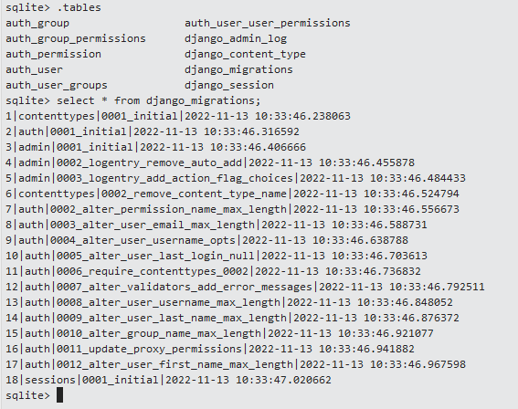

# Getting Started with Django

This project was created to learn Django based on several tutorials.

Python Version: 3.8.2

## Part 1: Initial setup

### Create new Django project

Create new project with a virtual environment:


Then add a file `requirements.txt` containing:

```text
asgiref==3.5.2
django>=3.0.3
pytz==2019.3
sqlparse==0.3.0
```

Install the packages in your virtual environment:


Among other dependencies, this also install Django.

Create a new Django project by running this command on the root folder:

```shell
django-admin startproject media_library
```

In the first media_library level, configure the folder to be a source root:


Then, go to media_library folder from terminal, and run:

```shell
python manage.py runserver
```

Check your installation by going to http://127.0.0.1:8000/.

### Create the media library website

On the media_library folder, run:

```shell
python manage.py startapp website
```

In the newly created `website` folder, clean up the files/folders and create new ones to follow this structure:

```shell
/website
  /static
    /website
      style.css
  /templates
    /website
      index.html  
    base.html    
  __init__.py
  views.py
```

The `base.html` may have been populated with some HTML code already. We will inherit our html page from this template so
let's update it:

```html

<!DOCTYPE html>
<html lang="en">
<head>
    <meta charset="UTF-8">
    <title> </title>
    <link rel="stylesheet" href="">
</head>
<body>


</body>
</html>
```

The base.html references a style.css... add some style to it:

```css
body {
    font-family: cursive;
    color: DarkCyan;
    background-color: #F0F8FF;
}
```

In the index.html, we can reuse our base template and extend with a body:

```html


Media Library


<h1>Welcome to the media library!</h1>
<p>
    {{message}}
</p>


```

In the `views.py`, define the following function:

```python
from datetime import datetime

from django.shortcuts import render


def index(request):
    return render(request, "website/index.html", {"message": "Helloworld displayed at " + str(datetime.now())})
```

Back the root folder, go to your media_library project and find the urls.py file:

```python
from django.contrib import admin
from django.urls import path

from website.views import index  # <-- add this line

urlpatterns = [
    path('admin/', admin.site.urls),
    path('', index, name="index"),  # <-- add this line
]
```

and in the settings.py file:, add `website` app:

```python
INSTALLED_APPS = [
    'django.contrib.admin',
    'django.contrib.auth',
    'django.contrib.contenttypes',
    'django.contrib.sessions',
    'django.contrib.messages',
    'django.contrib.staticfiles',
    'website',  # <-- add this line
]
```

Now restart the server:

```shell
python manage.py runserver
```

The following page should display:


### Set up the local DB & an admin user

In the ./root/media_library folder, a db.sqlite3 file was added when the project was first created.

If you have installed sqlite3.exe ([Download page](https://www.sqlite.org/download.html)), set your PATH and restarted
Pycharm, you can then start a sqlite shell by typing:

```shell
python manage.py dbshell
```

The command `.tables` will show no tables at this point since we didn't run any migrations.


To exit the shell, `.quit` and enter.

To run your first migration, run the command:

```shell
python manage.py migrate
```

Now the `.tables` command will returns tables:



Let's create an admin user:

```shell
python manage.py createsuperuser
```


Starting the server again, go to the http://127.0.0.1:8000/admin page.


Once connected:


## Part 2: Create the models and test data

Django provides ORM features with simplify greatly the development. One model will be equal to one DB entity.

Back to the ./root/media_library, we will create the following app:

```shell
python manage.py startapp albums
```

Some files and folders are already there, let's make sure that the structure looks like:

```shell
/website
  /migrations
  /templates
    /albums
  __init__.py
  admin.py
  forms.py
  models.py
  urls.py
  views.py
```

Let's add the app in settings.py:

```python
INSTALLED_APPS = [
    'django.contrib.admin',
    'django.contrib.auth',
    'django.contrib.contenttypes',
    'django.contrib.sessions',
    'django.contrib.messages',
    'django.contrib.staticfiles',
    'website',
    'albums'  # <-- add this line
]
```

Now create our first models (db agnostic):

```python
from django.db import models


class Genre(models.Model):
    name = models.CharField(max_length=50)

    def __str__(self):
        return f"{self.name}"


class Album(models.Model):
    title = models.CharField(max_length=250)
    artist = models.CharField(max_length=250)
    date_acquired = models.DateField()
    genre = models.ForeignKey(Genre, on_delete=models.CASCADE)

    def __str__(self):
        return f"{self.title} by {self.artist}"
```

cf. [Reference documentation](https://docs.djangoproject.com/en/4.1/ref/models/fields/)

Register your models by including the following in the admin.py file:

```python
from django.contrib import admin

from .models import Genre, Album

admin.site.register(Genre)
admin.site.register(Album)
```

We can create a migration plan using the command (db agnostic):

```shell
python manage.py makemigrations
```


To see the SQL generated:

```shell
python manage.py sqlmigrate albums 0001
```


We can then apply the schema changes:

```shell
python manage.py migrate
```

Once the changes are applied, run the server and access the admin page:


From the admin page, you can add a genre and albums to have a test dataset:


## Part 3: Create views and forms for your user

In the ./albums/templates/albums, add the following files

view_album.html:

```html


Album


<h1>{{album.title}}</h1>

<p>Artist: {{album.artist}}</p>
<p>Date Purchased: {{album.date_acquired}}</p>


```

list_albums.html:

```html


Albums


<h2>Albums</h2>
<a href="">Add new</a>
<ul>
    
    <li>
        <a href="">{{album}}</a>
    </li>
    
</ul>

```

Inside the `album` folder,

In the forms.py:

```python
from datetime import date

from django.apps import AppConfig
from django.core.exceptions import ValidationError
from django.forms import ModelForm, DateInput

from albums.models import Album


class AlbumsConfig(AppConfig):
    default_auto_field = 'django.db.models.BigAutoField'
    name = 'albums'


class AlbumForm(ModelForm):
    class Meta:
        model = Album
        fields = '__all__'
        widgets = {
            'date_acquired': DateInput(attrs={"type": "date"})
        }

    def clean_date(self):
        d = self.cleaned_data.get("date")
        if d < date.today():
            raise ValidationError("Date purchased cannot be in the past")
        return d
```

In the views.py:

```python
from django.shortcuts import render, get_object_or_404, redirect

from albums.forms import AlbumForm
from albums.models import Album


def view_album(request, id):
    album = get_object_or_404(Album, pk=id)
    return render(request, "albums/view_album.html", {"album": album})


def list_albums(request):
    return render(request, "albums/list_albums.html", {"albums": Album.objects.all()})


def create_album(request):
    if request.method == "POST":
        form = AlbumForm(request.POST)
        if form.is_valid():
            form.save()
            return redirect("list_albums")
    else:
        form = AlbumForm()
    return render(request, "albums/new_album.html", {"form": form})
```

In the urls.py:

```python
from django.urls import path

from .views import list_albums, view_album, create_album

urlpatterns = [
    path('<int:id>', view_album, name="view_album"),
    path('', list_albums, name="list_albums"),
    path('new', create_album, name="new_album")
]
```

Inside the `media_library` folder, urls.py:

```python
from django.contrib import admin
from django.urls import path, include

from website.views import index

urlpatterns = [
    path('admin/', admin.site.urls),
    path('', index, name="index"),
    path('albums/', include('albums.urls'))  # <-- new line
]
```

In the website index.html, add a link:

```html
<a href="">List albums</a>
```

From the website, you can now access those views and create new albums:


